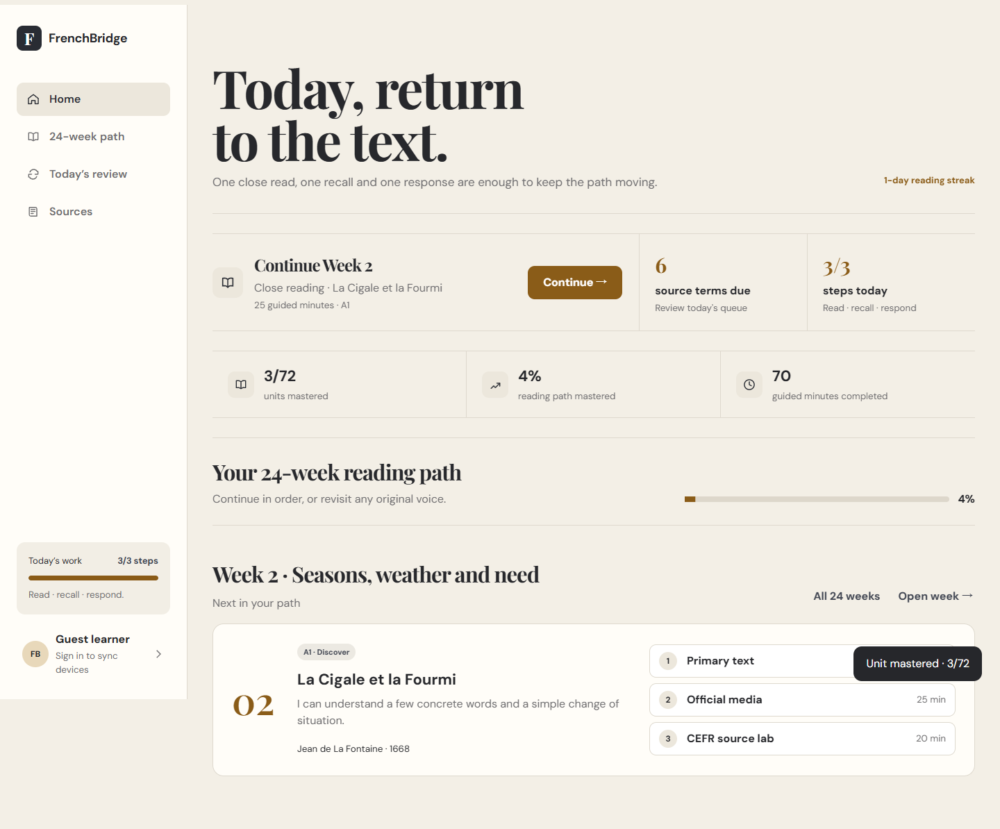
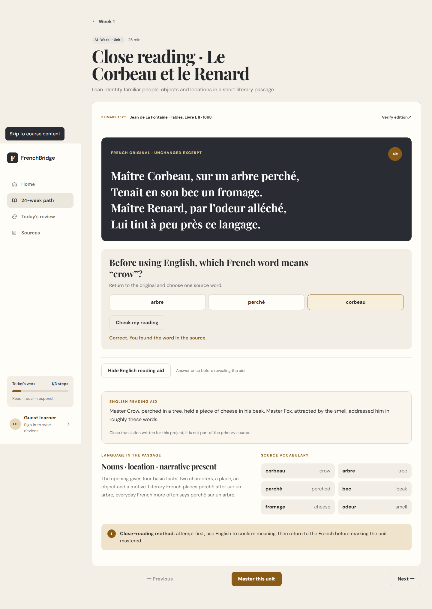
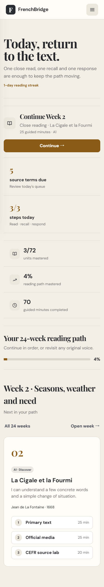
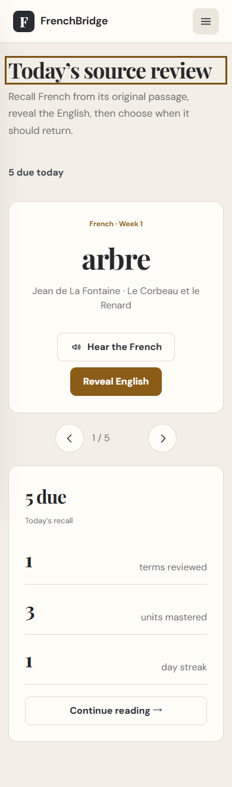

# FrenchBridge

> A reading-first French learning product built around original literature, official media and English learning support.

[Live product](https://frenchbridge-learn.pages.dev/) · [Product case study](docs/product-case-study.md) · [Architecture](docs/architecture.md)

## 中文简介

FrenchBridge 是我独立完成的一款“阅读优先”法语学习产品。它围绕法国文学原文、权威媒体和英文辅助，设计了 24 周、72 单元的 A1–B1 阅读路径。我负责产品定位、学习流程、交互与响应式设计、前端实现、账号同步、数据安全和在线部署。

这个公开仓库用于求职作品展示，提供产品案例、架构说明、关键技术示例和线上体验地址；完整课程、生产源码和云端配置保存在私有仓库中。

## What I built

FrenchBridge is a 24-week learning experience for English-speaking French learners. Instead of starting with an isolated vocabulary list, each lesson begins with a short attributed French passage. Learners attempt meaning first, reveal an English reading aid only after engaging with the source, then return later through scheduled recall.

I designed and implemented the product end to end:

- product positioning and information architecture;
- a 24-week A1–B1 reading path with 72 sourced units;
- attempt → reveal → recall lesson interactions;
- a Today dashboard and interval-based vocabulary review;
- offline-first progress, autosaved writing drafts and cross-device merging;
- Supabase authentication with row-level data protection;
- responsive, keyboard-accessible frontend and installable PWA behavior;
- deployment through Cloudflare Pages.

## Product highlights

### Reading before translation

The English aid is intentionally delayed until the learner has made an attempt. This turns translation into confirmation instead of a substitute for reading.

### A useful return experience

Returning learners see the next reading, due vocabulary and a compact daily loop instead of the original marketing introduction.

### Recall tied to original sources

Vocabulary cards retain their literary source and use three explicit review outcomes: Again, Hard and Remembered.

## Engineering decisions

| Problem | Decision |
|---|---|
| Learners may study offline | Local browser state remains the immediate source of truth |
| The same account can change on two devices | Set-like progress is merged by union; editable records use timestamp-based last-write-wins |
| Old users already have saved completion data | State normalization migrates legacy completion into attempted and mastered states without deletion |
| Translation can short-circuit reading | English support stays locked until the first source-based attempt |
| A static product still needs accounts | Supabase Auth and one owner-protected JSON progress row keep the deployment lightweight |
| The project must remain inexpensive | Static hosting and the free database tier are sufficient for the intended small audience |

Representative, reduced examples are available in [`samples/`](samples/). They demonstrate the underlying decisions without publishing the full production application or curriculum.

## Technology

- Semantic HTML, modern CSS and framework-free JavaScript
- LocalStorage for offline-first persistence
- Supabase Auth, PostgreSQL and Row Level Security
- Cloudflare Pages
- Service Worker and Web App Manifest
- Browser Speech Synthesis for French pronunciation

## Scope and results

- 24 weeks
- 72 learning units
- 144 source-linked vocabulary items
- A1 → A2 → B1 reading progression
- Desktop and 390px mobile layouts
- Guest learning plus optional account synchronization

## Repository scope

This public repository is a portfolio case study, not the production source repository. It includes product documentation, interface captures and reduced technical examples. The complete curriculum, production code, cloud configuration and deployment files are intentionally excluded.

The live product is available for evaluation at [frenchbridge-learn.pages.dev](https://frenchbridge-learn.pages.dev/).

## What I would build next

- native WeChat Mini Program experience with a bottom-navigation learning shell;
- a personal reading archive with saved passages and writing history;
- richer A2/B1 comprehension formats beyond vocabulary recognition;
- privacy-friendly product analytics for activation and retention decisions.

## Rights

© 2026 FrenchBridge. All rights reserved. See [NOTICE](NOTICE.md).
