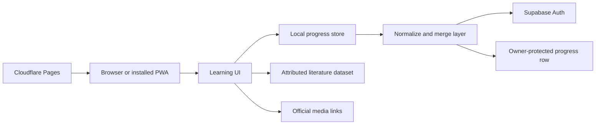

# Architecture

## System overview

FrenchBridge is intentionally lightweight. The learning application is a static frontend; Supabase provides authentication and a single private progress document per learner.

## Progress model

The state distinguishes activity from mastery:

- `attempted`: the learner has interacted with a unit;
- `mastered`: the unit-specific completion evidence has been satisfied;
- `readingChecks`: answer, reveal and correctness state;
- `mediaTasks`: persistent task evidence;
- `drafts`: autosaved written responses;
- `review`: due date, interval and most recent grade;
- `studyDays`: date-aware daily activity.

Legacy completion IDs are normalized into both attempted and mastered states, preserving existing learner progress.

## Cross-device merge policy

Different fields require different conflict rules:

| State type | Merge rule |
|---|---|
| Attempted/mastered IDs | Set union |
| Reviewed-card IDs | Set union |
| Numeric totals | Maximum value |
| Daily activity | Maximum value for each calendar day |
| Drafts and task records | Newest `updatedAt` wins |
| Onboarding completion | Logical OR |

This policy prevents one device from erasing legitimate progress on another while still allowing editable records to converge.

## Security boundary

- The client contains only a browser-safe publishable identifier.
- Secret and service-role credentials are never shipped to the browser.
- PostgreSQL Row Level Security restricts each learner to their own progress row.
- Account data is optional; guest mode stays fully usable offline.
- This public repository contains neither the real configuration nor the production database identifiers.

## Failure behavior

If the network or cloud service is unavailable, local work continues. Synchronization is retried after connectivity returns. Drafts are saved before they are queued for cloud synchronization, reducing the risk of losing writing during interruptions.

